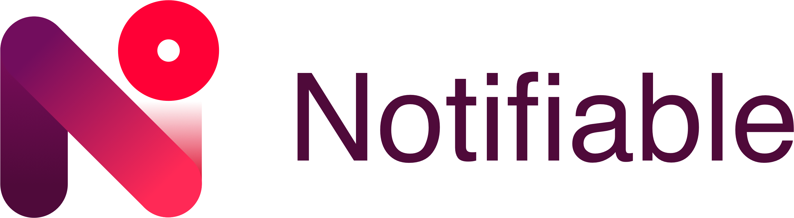

<br>
A product that allows companies to manage notifications for Android and iOS from a single web platform.

`Notifiable` uses the native notification system for each platform.

# Notifiable-Android

**BREAKING CHANGE: SDK requires minSdk 23**

**Notifiable-Android** is a library that allows you to easily register a device for receiving notifications initiated from a Notifiable server.

The library will take care of getting the Firebase Messaging Token when registering a new device.

Checkout the [sample-app](sample-app) for examples on how to use the SDK.


### Content table

- [Setup](#setup)
- [Handle dependency conflicts](#dependency-conflict-resolution)
- [Usage](#usage)
- [API overview](#api-overview)
- [Receiving notifications](#receiving-notifications)
- [Token invalidation](#server-token-invalidation)

## Setup

##### 1. Update your project's `build.gradle` file to include Jitpack

	
	allprojects {
	 repositories {
	    jcenter()
	    maven { url "https://jitpack.io" }
	 }
	}
	

##### 2. Update your app `build.gradle` file and add the Notifiable dependency

	 implementation 'com.github.FutureWorkshops:Notifiable-Android:2.0.1@aar'
	
	
PS: replace `2.0.1` with the latest version available
	
* Don't forget the **@aar**!*


##### 3. Add ProGuard rule

Add the following rule to your exising ProGuard setup
	
	-keep class com.futureworkshops.notifiable.model.** { *; }
	

#### Transitive dependencies

The Notifiable SDK relies on other 3rd party libraries to function **that must be available at compile time**:
-  `com.android.support:support-annotations:27.0.0`
-  `joda-time:joda-time2.10.1`
- `com.squareup.retrofit2:retrofit:2.3.0`
- `com.squareup.retrofit2:converter-gson:2.3.0`
- `com.squareup.retrofit2:converter-scalars:`
- `com.squareup.okhttp3:okhttp-urlconnection:3.10.0` 
- `com.squareup.okhttp3:logging-interceptor:3.10.0`
- `io.reactivex.rxjava2:rxjava:2.2.8`
- `io.reactivex.rxjava2:rxandroid:2.0.2`


You can automatically add all of the above dependencies by using

```
  implementation ('com.github.FutureWorkshops:Notifiable-Android:2.0.1@aar'){
      transitive true
  }
```    

#### Dependency conflict resolution

##### 1. Exclude modules from Notifiable library

You can exclude as many modules as you want:

```
 implementation ('com.github.FutureWorkshops:Notifiable-Android:2.0.1'){
     exclude group: 'com.android.support', module:'support-annotations'
     exclude group: 'joda-time', module:'joda-time'
 }
```


##### 2. Force resolution of dependency

You can resolve the conflict by specifying which dependecy version should be used by the entire app 

```
android {
    configurations.all {
        resolutionStrategy.force 'joda-time:joda-time2.10.1'
    }
}
```

### Add Notifiable manually 

You can also download the `.aar` and use it directly but in this case you 
will **not be able to manage transitive dependencies**!


 1. Download the latest `.aar` from the *Releases* tab on github.

 2. Update your project `build.gradle`
	Update the project *build.gradle* file (the one from the root of the project) 
	
	```
	allprojects {
	    repositories {
	        flatDir {
	            dirs 'src/main/libs'
	        }
	    }
	}
	```

 3. Add dependency in your app's `build.gradle`

	You are now ready to add the dependency to your application
	
	```
	 implementation(name: "NotifiableAndroidSDK-${notifiableVersion}", ext: 'aar')
	
	```

4. Add required dependencies
 
	```
	 implementation  'com.android.support:support-annotations:27.0.0'
	 implementation  'joda-time:joda-time2.10.1'
	 implementation  'com.squareup.retrofit2:retrofit:2.3.0'
	 implementation  'com.squareup.retrofit2:converter-gson:2.3.0'
	 implementation  'com.squareup.retrofit2:converter-scalars:'
	 implementation  'com.squareup.okhttp3:okhttp-urlconnection:3.10.0' 
	 implementation  'com.squareup.okhttp3:logging-interceptor:3.10.0'
	 implementation  'io.reactivex.rxjava2:rxjava:2.2.8'
	 implementation  'io.reactivex.rxjava2:rxandroid:2.0.2'
	```

5. Add ProGuard rule

	Add the following rule to your exising ProGuard setup
	
	```
	-keep class com.futureworkshops.notifiable.model.** { *; }
	```

## Usage

The SDK provides a `NotifiableManagerRx` component that allows you to register devices and perform notification related tasks - like marking a notification as received.

`NotifiableManagerRx` tries to do most of the boilerplate work like:

- getting a token from Firebase when registering a device
- holding a reference to the registered `NotifiableDevice` ID

To create an instance of NotifiableManagerRx you can use the provided builder:

```
  NotifiableManagerRx.Builder(context)
            .endpoint(config.notifiableEndpoint)
            .credentials(config.notifiableClient, config.notifiableSecret)
            .debug(config.logsEnabled)
            .build()
```

* `endpoint` - the URL of the Notifiable server
* `credentials` - the notifiable client ID and secret
* `debug` - specify if the instance should print debug logs
* `schedulersProvider` - you can optionally provide a custom `INotifiableScheduler` to specify the threads used to run the notifiable calls


## API overview

### registerDevice

```
  fun registerDevice(
        deviceName: String? = null,
        userAlias: String? = null,
        locale: Locale? = null,
        customProperties: HashMap<String, String>? = null
    ): Single<NotifiableDevice>
```

Use this method to register a device on a Notifiable server. The new version of the SDK will now check if Play Services are available and try to obtain a Firebase token automatically.

The method can throw a `GooglePlayServicesException` if Play services are not available.

| Parameter        | Description           |
| ------------- |:-------------|
| `deviceName`      |   the name to be used for the device, defaults to `Build.DEVICE`|
| `userAlias`\*      | string used to identify the user on the Notifiable server, defaults to EMPTY string  |
| `locale`      |  optional parameter to specify the Locale of the device |
| `customProperties`      |  optional parameter to specify a `Map` of device properties |


\* **userAlias** -  In the ideal scenario, the user alias should be provided by the user management system: after a successfull authentication the user profile should contain the userAlias

### getRegisteredDevice

```
  fun getRegisteredDevice(): Single<NotifiableDevice> 
```

The new SDK automatically saves the registered `NotifiableDevice` using `androidx.security.crypto.EncryptedSharedPreferences` and this method will return the registered device or throw an exception if no device is found.


### updateDeviceInformation

```
   fun updateDeviceInformation(
        token: String? = null,
        userAlias: String? = null,
        deviceName: String? = null,
        locale: Locale? = null,
        customProperties: Map<String, String>? = null
    ): Completable
```

The process of updating a device has been streamlined and there is now a single method with optional named parameters that can perform all the required operations.

If a parameter is specified, it will be sent to the server otherwise it will be ignored

| Parameter        | Description           |
| ------------- |:-------------|
| `token`      |   update the Firebase Messaging token|
| `userAlias`      | update the user alias |
| `locale`      |  update device locale |
| `customProperties`      |  update one or more custom device properties |


### unregisterDevice

```
 fun unregisterDevice(): Completable
```

Unregister the device and remove it from the `androidx.security.crypto.EncryptedSharedPreferences`.


### markNotificationReceived

```
 fun markNotificationReceived(notificationId: String): Completable
```

This will tell the `Notifiable server` that a notification has been received on this device.

| Parameter        | Description           |
| ------------- |:-------------|
| `notificationId`      |   the ID of the received notification|


### markNotificationOpened

```
fun markNotificationOpened(notificationId: String): Completable
```

This will tell the `Notifiable server` that a notification has been opened on this device.

| Parameter        | Description           |
| ------------- |:-------------|
| `notificationId`      |   the ID of the received notification|


The notification ID can be obtained from a `NotifiableMessage` object.


### createNotificationFromMap

```
fun createNotificationFromMap(data: Map<String, String>): NotifiableMessage
```

This is a public extension method that you can use to create a `NotifiableMessage` object from a standard Firebase notification.

Example:

```

class MyFirebaseMessagingService : FirebaseMessagingService() {
 
	 override fun onMessageReceived(remoteMessage: RemoteMessage) {
	  val notification = createNotificationFromMap(remoteMessage.data)
	  // ...
	 }
}
```

## Receiving notifications

Notifiable is not a messaging service and relies on the Firebase Cloud Messaging Platform to forward notifications to clients, therefore, you need to follow the [Firebase instructions](https://firebase.google.com/docs/android/setup/) to setup your app.

After Firebase is set up, you need to create a service that extends `FirebaseMessagingService` - this will allow your application to receive notifications but this is also a great place to use `NotifiableManagerRx` to update a device token and to mark notifications as received. 

Checkout the [sample-app](sample-app/src/main/java/com/futureworkshops/notifiable/sample/presentation/service/MyFirebaseMessagingService.kt) for a fully working example using Dagger.


## Server token invalidation

The **Notifiable** server can automatically handle multiple registrations from the same device:

- Client (iOS/Android App) gets a token from APNS/FCM
- Sends to Notifiable
- Notifiable checks if the token exists (not - not the user)
- If token exists we return the Notifiable ID for that token.
- If token does not exist we create a new Notifiable ID
- Client can then update tags / custom properties associated with that Notifiable ID
- Notifiable sends notifications. If FCM/APNS says the token was invalid we remove the token.

## LICENSE

[Apache License Version 2.0](LICENSE)
