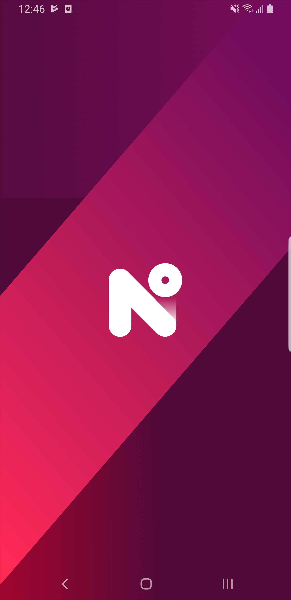
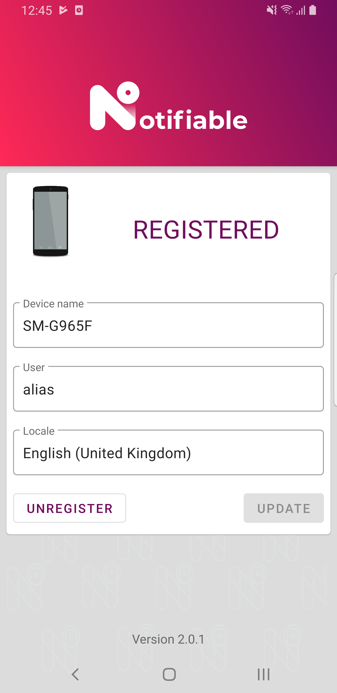
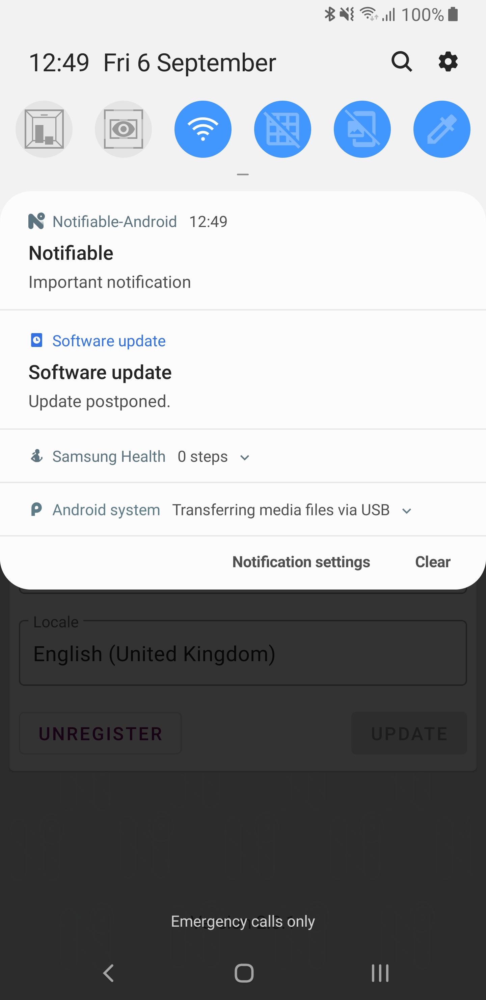
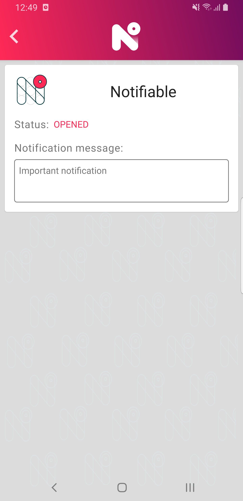

 

This is a simple application that shows you how to interact with the **Notifiable-Android** SDK.

## Setup

**Before you can run the sample app you need to configure Firebase Cloud Messaging for your project !**

Instructions can be found [here](https://developers.google.com/cloud-messaging/android/client#get-config).

You need to place the *google-services.json* file generated by your Console Project in the `sample-app` folder.

### Notifiable parameters

Before you can run the app you need to specify your Notifiable endpoint and credentials by updating the following fields declared in `gradle.properties`

- `notifiable.server`
- `notifiable.client`
- `notifiable.secret=`

## Screenshots

## LICENSE

[Apache License Version 2.0](../LICENSE)