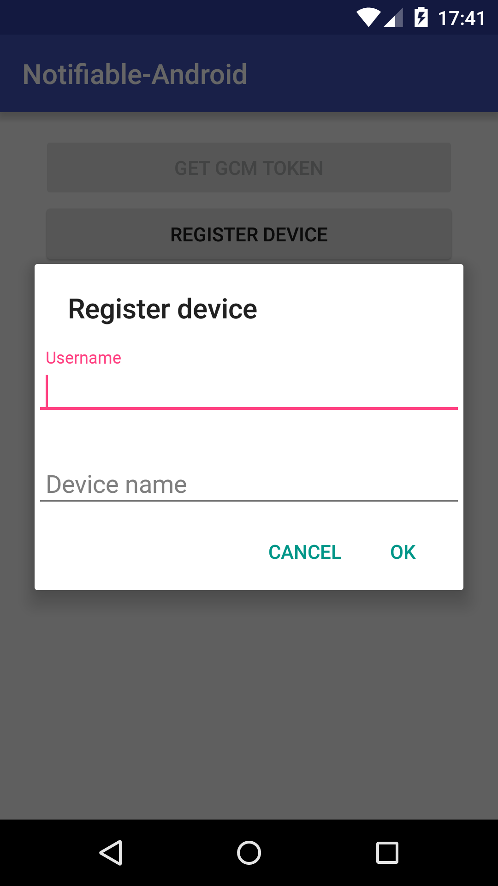
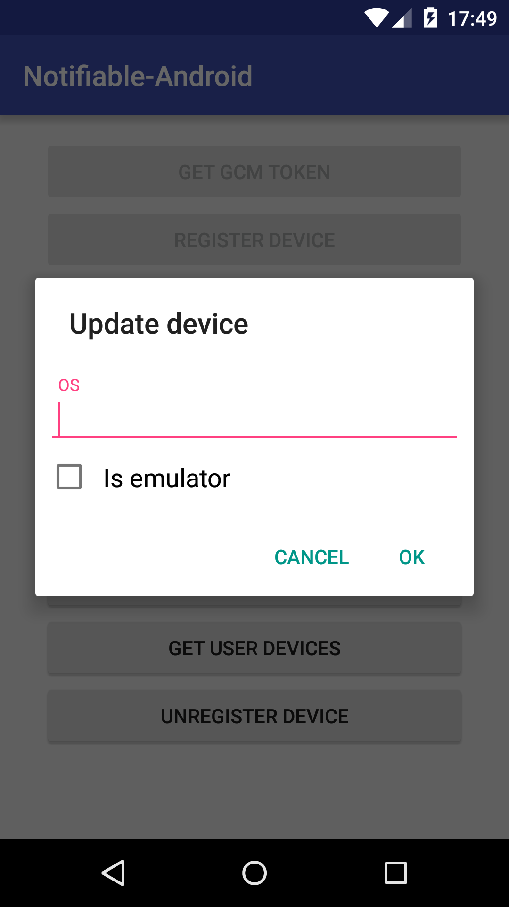
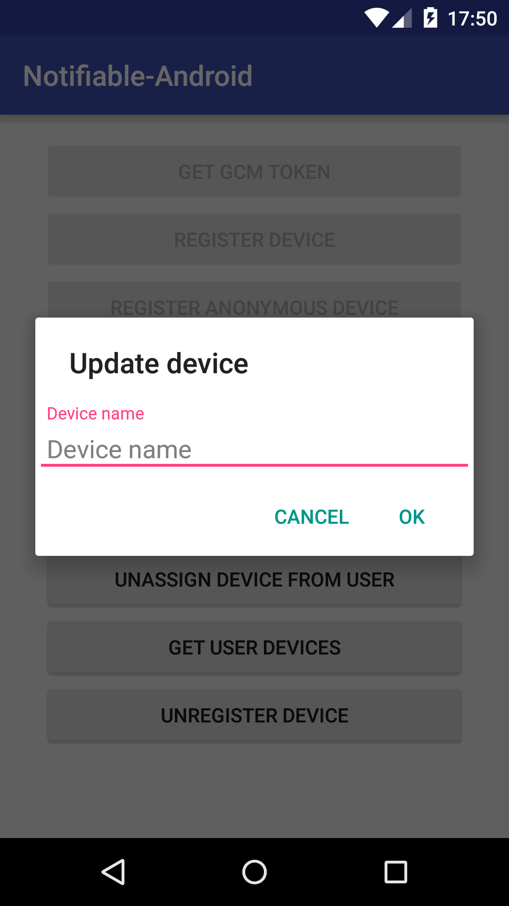
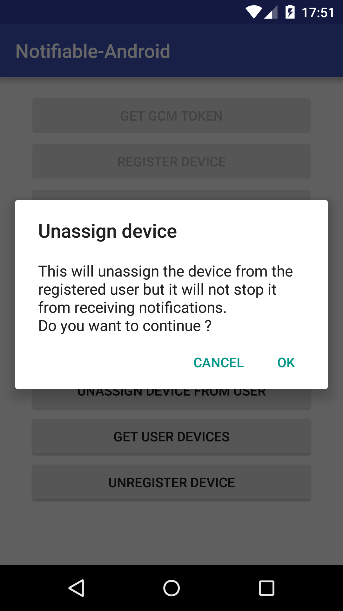
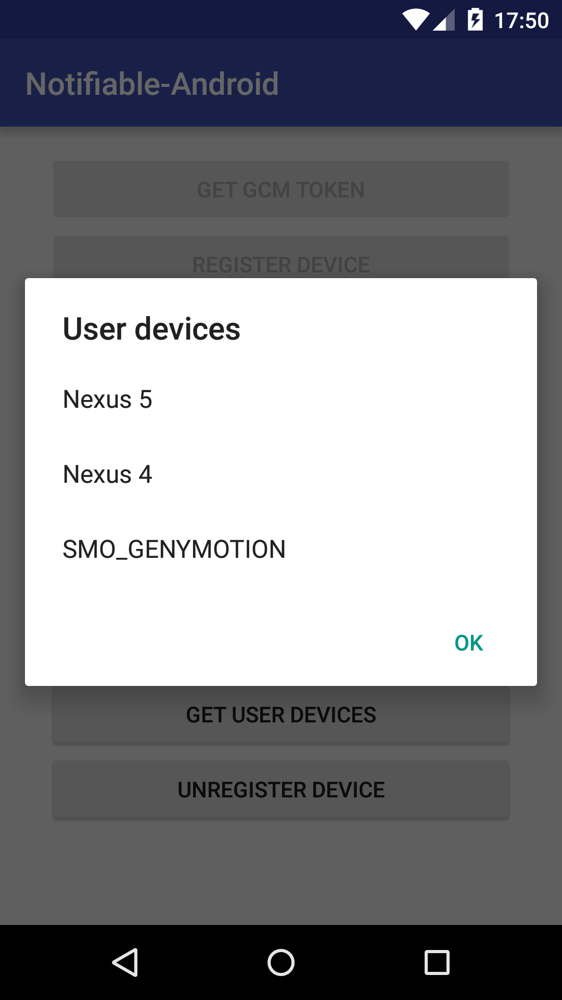
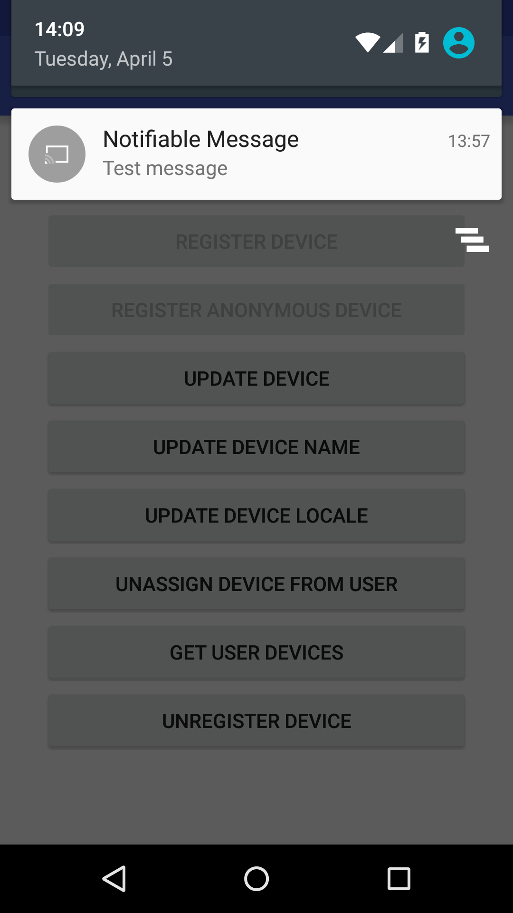

# Notifiable-Android Sample

**Notifiable-Android Sample** is a simple application that show you how to interact with the **Notifiable-Android** library.

The app tries to demonstrate the functionality of the library in a simple way, without too much complexity. 

## Setup

**Before you can run the sample app you need to configure Google Cloud Messaging for your project !**

You need to place the *google-services.json* file generated by your Console Project in the `sample-app` folder.

Instructions can be found [here](https://developers.google.com/cloud-messaging/android/client#get-config).

Before you can run the app, you also need to update the following fields declared in `gradle.properties`

- `notifiable.server`
- `notifiable.client`
- `notifiable.secret=`

## Screenshots

## LICENSE

[Apache License Version 2.0](../LICENSE)